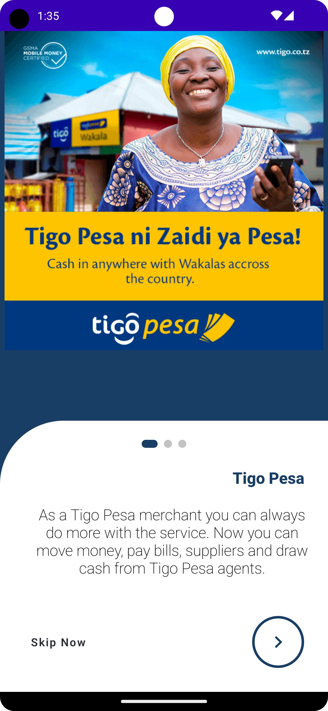

# Onboarding

Jetpack Compose clone of Tigo Pesa App, an opportunity to showcase Android development skills by
creating a stunning UI for mobile payments using Kotlin and Jetpack Compose.

## Screenshots

## Technologies Used

- Kotlin
- Jetpack Compose
- Jetpack Navigation
- Hilt Dependency Injection
- Material Design

## Installation

Clone this repository and open it using Android Studio Giraffe or higher. Make sure you have the
latest version of the Android Gradle Plugin installed. The project uses the Hilt Gradle Plugin to
generate the Dagger/Hilt dependency injection code, so you should also make sure that you have the
kotlin-kapt plugin enabled in your build.gradle file.

## Usage

The app simulates a mobile payments UI, allowing the user to enter a phone number, select a payment
method, and confirm the transaction. The app uses Jetpack Compose to create a dynamic and visually
appealing UI, and Jetpack Navigation to handle navigation between screens. Hilt is used for
dependency injection, making it easy to manage dependencies and avoid boilerplate code.

## Video

Check out the demo video of the TigoPesa app [here](docs/Tigo.mp4).

## Contributions

Contributions are welcome! Feel free to fork this repository and submit a pull request.